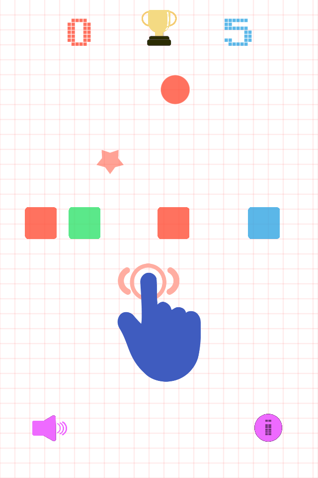

# Tilty Ball
Tilty Ball is an endless arcade-style game.

### Information 
For the version release on App Store, please use the [tag 1.0](https://github.com/cornerstonecollege/tetris-ball/tree/1.0). 

### How to play
Tilt your phone from side to side to move the ball around the screen.

Try to land on a block with the same color as your ball, in order to keep playing! Hit the stars to change your color.

Be careful not to land on a non-matching block, or you’ll have to start it again.

### Help
Feel free to help the repository, sending your pull requests.

### LICENSE
This project is distibuted under [GNU GPL v. 2](https://www.gnu.org/licenses/old-licenses/gpl-2.0.en.html) License, so be aware of that, regarding copying, modifying and (re)destributing the application. 
